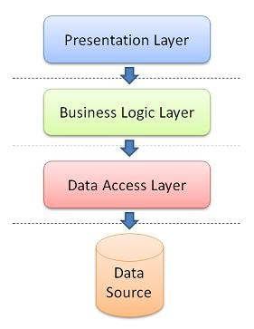

# TESODEV ORDER APPLICATION

This is Tesodev Challange Project. You can check below for the project infrastructure and more information. 

##Domain
The project has a basic e-commerce application domain. There are two simple microservices which Customer and Order services. Each project has different architectures and libraries. There is one gateway project, which it is a asp core web api project and using Ocelot gateway library. You can see more information about microservices down below.

<p align="center">
  
</p>


##Customer Microservice
Customer project is responsible for handling customer transactions such as read, create, update, delete, and validate. I used Entity Framework Core as ORM technology and Microsoft Sql Server Database as Database. In this project i used N-tier architecture. There are data access, business and web api layers as mainly, and entity layer as sidely. 

<p align="center">
  
</p>

Also all the unit test has written and successfully completed for controller and business layers.

<p align="center">
  
</p>


##Order Microservice
Order project is responsible for handling order transactions such as read, create, update and delete. When creating and updating an order, validates customer. This transaction is performed by making a synchronous request to the Validate Customer endpoint in customer microservice. In this project, i used Entity Framework Core as ORM technology, and PostgreSQL as Database. Also in this project, i used Onion Architecture what an implementation of the Clean Architecture. I Created four layers which Domain, Application, Infrastructure and Web Api. I used CQRS and mediator pattern, and used mediatr library for implementation of the mediator and CQRS pattern.

<p align="center">
  
</p>

Also all the unit test has written and successfully completed for command and query handlers.

<p align="center">
  
</p>

##Gateway
Gateway project is a simple asp core web api project and it is responsible for communicate micro services. It has a specific path format. This format is like that : https://localhost:5000/services/{servicename}/{everything}. servicename part is name of the micro service which you want to reach. And everything part transmitted as is. 

As sample, if you want to reach customer micro service and list the customers, then you must make a GET request to the path given below. 

```https://localhost:5000/services/customer/api/Customers (GET)```

If you want to reach order micro service and create an order, then you must make a POST request to the path given below with the specified model body.

```https://localhost:5000/services/customer/api/Orders (POST)```
